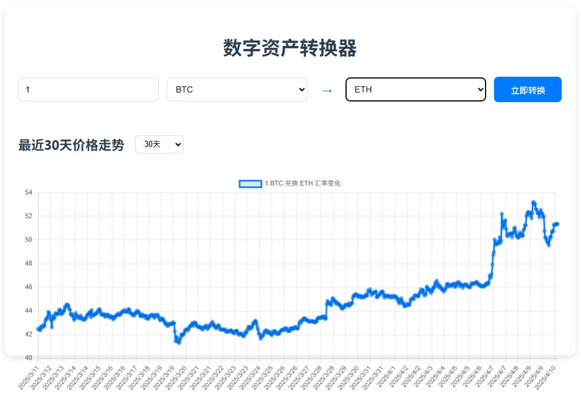
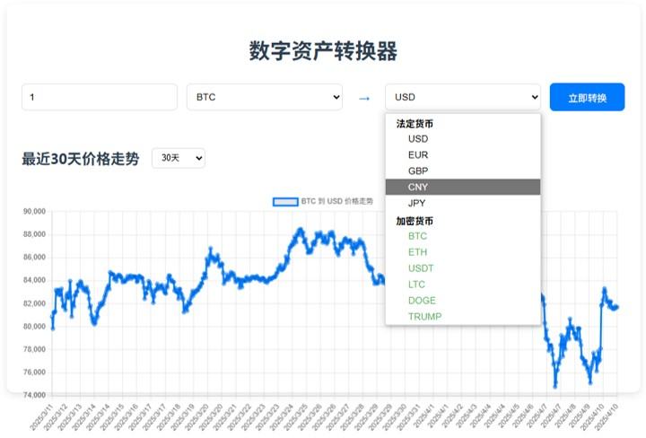

# Digital Asset Converter

A modern React application that allows conversion between various types of financial assets, including:
- Fiat currencies (USD, EUR, JPY, etc.)
- Digital currencies/cryptocurrencies (BTC, ETH, etc.)
- Cross-conversions between different digital currencies

This tool provides real-time exchange rates and a user-friendly interface to quickly convert between any supported currencies.



## Features

- Seamless conversion between fiat and digital currencies
- Real-time exchange rate data
- Intuitive and responsive user interface
- Historical rate charts for analysis
- Support for a wide range of currencies

## Getting Started

### Prerequisites

- Node.js (v16 or later)
- npm or yarn

### Installation

1. Clone the repository:
   ```bash
   git clone https://github.com/yourusername/currency-converter.git
   cd currency-converter
   ```

2. Install dependencies:
   ```bash
   npm install
   # or
   yarn install
   ```

3. Start the development server:
   ```bash
   npm start
   # or
   yarn start
   ```

4. Open your browser and navigate to:
   ```
   http://localhost:3000
   ```

## Screenshots

### Main Conversion Interface (include history rate chart)


### Currency Selection


## Technologies Used

- React
- Axios for API requests
- Chart.js for data visualization
- CSS for styling

## License

This project is licensed under the MIT License - see the LICENSE file for details.